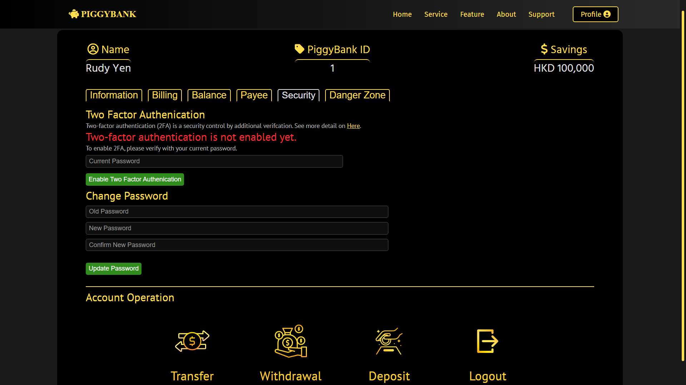

# PIGGYBANK

## Table of Contents
* [Introduction](https://github.com/yenloned/PiggyBank#introduction)
* [Live Demo](https://github.com/yenloned/PiggyBank#live-demo)
* [Technologies](https://github.com/yenloned/PiggyBank#technologies)
* [Getting Started](https://github.com/yenloned/PiggyBank#getting-started)
* [Architectures](https://github.com/yenloned/PiggyBank#architectures)
* [Design](https://github.com/yenloned/PiggyBank#design)
* [Functions](https://github.com/yenloned/PiggyBank#functions)
* [Features](https://github.com/yenloned/PiggyBank#features)
* [Preview](https://github.com/yenloned/PiggyBank#preview)
* [Epilogue](https://github.com/yenloned/PiggyBank#epilogue)

## Introduction
PiggyBank is a fully responsive web application, which operates and provides various bank functions by REST API and CRUD Operations. 
It does not involve any real currencies, trading, contracts, or agreements since this project is aimed to demo the web development technologies and practice.

## Live Demo
This project is still on development status (8/5/2022). The website will be hosted after completion.

## Technologies
**FrontEnd**
* [ReactJS](https://reactjs.org/)
* [CSS](https://www.w3.org/Style/CSS/)

**BackEnd**
* [NodeJS](https://nodejs.org/en/docs/)
* [ExpressJS](https://expressjs.com/)
* [MySQL](https://dev.mysql.com/doc/)

**Other Highlighted Libraries**
* [Axios](https://axios-http.com/docs/intro)
* [JSON Web Token](https://jwt.io/)
* [Bcrypt](https://www.npmjs.com/package/bcrypt)
* [NodeMailer](https://nodemailer.com/about/)

## Getting Started

* FrontEnd (ReactJS)
```node
// change current directory to frontend
cd frontend

// install required node_module
npm install

// start ReactJS server
npm start
```

* BackEnd (NodeJS)
```node
// change current directory to backend
cd backend

// install required node_module
npm install

// start NodeJS server
node index.js
```

* Database (MySQL)
```node
// Create database and running on port 3006
```

Open [http://localhost:3000](http://localhost:3000) and you will see the page appear.

## Architectures
### Overview


## Design
* Fully Responsive
  - _Make use of CSS breakpoints, to create scalable and user-friendly display sizes in all contents for any device's screen._
* RESTful API
  - _Make use of Axios, creating different communication channels for data requests and responses with the defined endpoints._
* CRUD Operation
  - _Make use of MySQL, which performs the operation of Create, Read, Update, and Delete as data management._

## Functions
* Account Register / Login
  - _Make use of database and cookie session, which performs the data creation (registration) and cookie value authentication (login)._
* Transfer / Withdrawal / Deposit
  - _Make use of RESTful API and database, to update the user's balance data once the transfer request is received from users._
* Loan
* Insurance

## Features
* JWT Token
  - _Enhance security by the authorization with JWT Token, preventing attacks like Cross-Site Scripting XSS and Session Hijacking._
* Password Hashing
  - _Make use of Bcrypt, to ensure password confidentiality in the database by a strong one-way hashing algorithm._
* Forgot Password (Email)
  - _Make use of SMTP Server and NodeMailer, sending a verification code to users who are required to reset their password._
* Two-Factor Authentication (Email)
  - _Once that user's account has enabled Two-Factor Authentication, a verification code will be sent through SMTP Server by NodeMailer before every login._
* Payee Registration
  - _Make use of RESTful API and database, create and read the payee list from the database whenever the user performs related operations (register payee/transfer money)._
* Debt
  - _Make use of database, creating and updating the user's debt records for related operations (loan/pay debt)._
* Transaction History
  - _Make use of database, creating a detailed record (amount, time, event type, etc.) whenever the user performs an operation ( Transfer / Withdrawal / Deposit)._
* Credit Scoring
  - _A grade result calculated by an algorithm with the user's balance and debt, simulating the real-world credit calculation which is used in loan applications._
* Insurance / Loan Calculator
  - _Make use of React component state, calculating and displaying the result by user's options and input in real-time._
* Password Changing
  - _Make use of RESTful API and database, updating the user's password once the request is received._
* Account Termination
  - _Make use of RESTful API and database, deleting all the data from that user once the request is received._

## Preview

### <p align="center">Desktop View</p>
||
|----------------------------------------|
||
||
||
||

### <p align="center">Phone View</p>
| | | | |
|-------------------------------|-------------------------------|-------------------------------|-------------------------------|
|||||


## Epilogue
Wow, you really read this to the end.<br>
This was my very first full-stack web development project and I have learned a lot from it. Feel free to contact me for any discussion or suggestion. In the future, I will keep creating and developing new projects in order to further deepen my skills and knowledge.