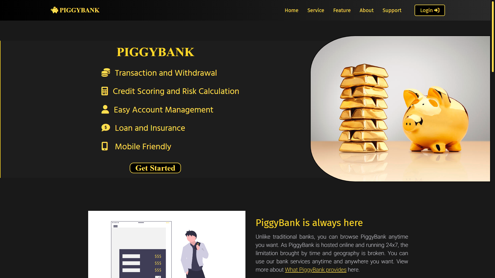
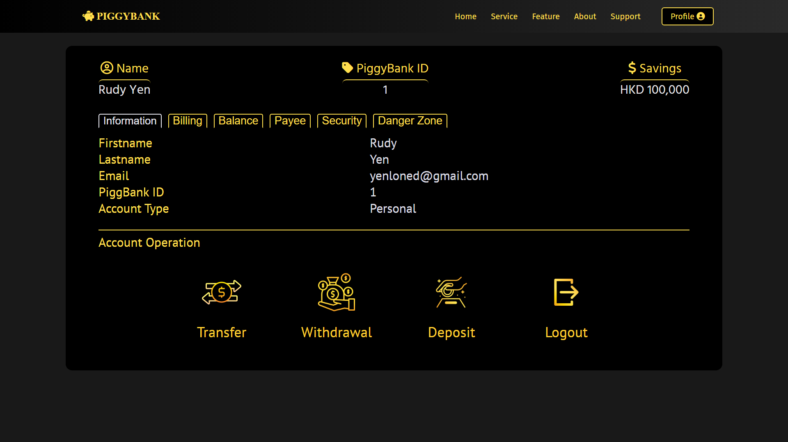
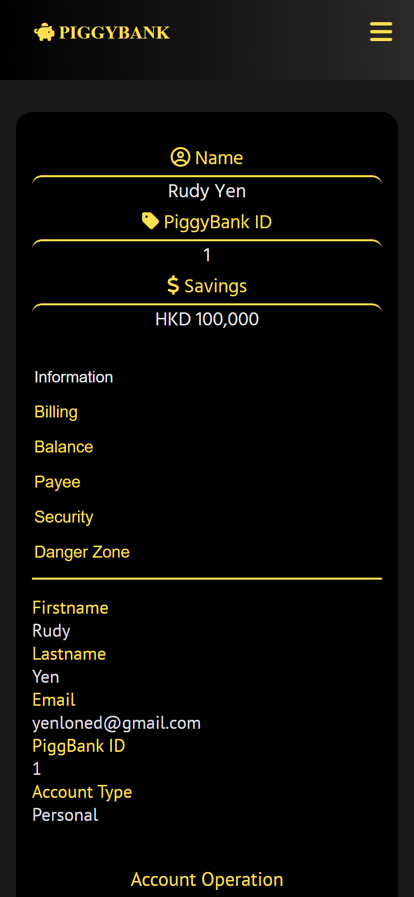

# PiggyBank

PiggyBank is a fully responsive web application, which operates and provides various bank functions by REST API and CRUD Operations.

> Notice: This project is still on development status (25/4/2022). The website will be hosted after completion.

## Technologies
ReactJS, CSS, NodeJS, ExpressJS, MySQL, Axios, Bcrypt

## Getting Started

Running FrontEnd (ReactJS)
```node
cd frontend
npm install
npm start
```

Running BackEnd (NodeJs)
```node
cd backend
npm install
node index.js
```

Open [http://localhost:3000](http://localhost:3000) and you will see the page appear.

## Highlights

#### Design and Architecture
* Fully Responsive
* RESTful API
* CRUD Operation
#### Functions
* Account Register / Login
* Transfer
* Withdrawal
* Deposit
* Loan
* Insurance
#### Features
* JWT Token
* Password Hashing
* Forgot Password (Email)
* Two-Factor Authentication (Email)
* FAQ Page
* Payee Registration
* Debt
* Transaction History
* Credit Scoring
* Insurance / Loan Calculator
* Password Changing
* Account Termination


## Preview

Desktop | Phone
----------------------------------------|--------------------------
   | 
   | 


## Learn More

You can learn more in the [Create React App documentation](https://facebook.github.io/create-react-app/docs/getting-started).

To learn React, check out the [React documentation](https://reactjs.org/).

To learn NodeJS, check out the [NodeJS documentation](https://nodejs.org/en/docs/).

To learn MySQL, check out the [MySQL documentation](https://dev.mysql.com/doc/).
